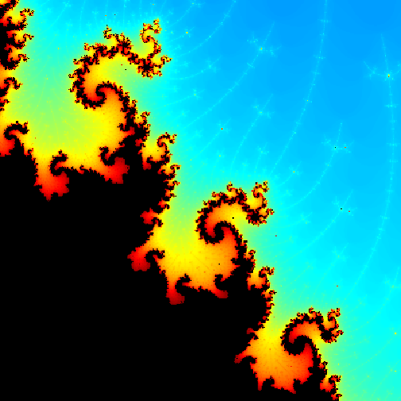

## The Problem with Math...

- Far to many people perceive math as being an unappealing subject
- There are a variety of reasons for this perception
    - They find it boring or monotonous
    - Lacks emotional appeal
    - Difficult to understand
- Observe this equation below

$$f(Z_{n+1}) = Z_{n}^2 + C$$

- Nothing exciting here, right? But...

---

## ...doesn't have to be a problem

What if I told you that boring old equation is used to draw something like this?

 

---

## The good things about math

- As we see, not all math has to be boring or unattractive
- Math can be
    - Creative
    - Beautiful
    - Interactive
    - Dare I say even interesting?
- Is math hard? It can be at times, but maybe with the proper motivation others can be convinced that it's worth the effort.
- Math can even be useful every day, if someone is equipped to see the role it plays in our lives every day. Math plays a role in the form of things we see every day.
    - The arrangement of the seeds of a sunflower
    - The shape of a snowflake
    - Even the way a tree branches can be explained using math

---

## Enter the Shiny Mandelbrot App

- So to help fulfill the need to excite people about math I present the Shiny Mandelbrot App
    - http://kbelsvik.shinyapps.io/Data_Products_Project/
- This is an interactive Shiny app that can be used to create beautify images from the Mandelbrot Set
- How the math behind this is relatively simple and can be used to create some stunning images
- The math works in this way
    - We have two complex numbers Z and C
    - Z starts out equal to 0, and C begins with some value representing a point on a plot $(x, y) \rightarrow x + yi$
    - We then apply the formula $f(Z_{n+1}) = Z_{n}^2 + C$ repeatedly, counting the number of repetitions, until Z escapes into infinity (in this case we define infinity as anything greater than 2).

---
## How it all works

```r
z <- complex(re=0, im=0)
c <- complex(re=-0.87, im=0.25)
escape <- 0
while(Mod(z) < 2){
    z <- z^2 + c
    escape = escape+1
}
escape
```

```
## [1] 27
```
- So now we have a number, which we map to a color, then color the the point that C represented that color, points that never escape are colored black.
- Do that for all points, and you have an image of the Mandelbrot set.
